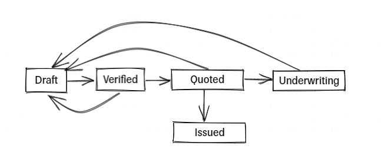

<h2>Поведенческие паттерны</h2>

Страховая компания на текущий момент страхует Авто и Имущество. 
В дальнейшем планируется добавить новые виды страхования.
Необходимо реализовать сервис по выпуску полисов, используя поведенческий паттерн(-ы)

Дата модель: package task.behavioral.dummy.dto

Чтобы застраховать Авто в запросе передаем vin, Имущество - address.

<pre>
Выпуск полисов проходит в несколько шагов, на каждом шаге полис меняет свой статус. 
    dataVerification() - проверка данных
    requestQuote() - расчет премии
    issue() - выпуск
</pre>

<pre>
dataVerification() - если верификация не пройдена, полис остается в статусе Draft
    Авто - Длина VIN должна быть = 17 символам
    Имущество - Адрес должен содержать подстроку "Russia"
</pre>

<pre>
requestQuote()
    Авто - Премия это последние 5 символов из VIN, в которох оставляем только числа
    Имущество - fix 500 рублей
</pre>

<pre>
issue() 
    Авто - если премия по полису > 5000, переводим на Underwriting, иначе Issued
    Имущество - Issued
</pre>

<h4>Статусная модель:</h4>
Статус полиса должен меняться в соответсвии со схемой.

    